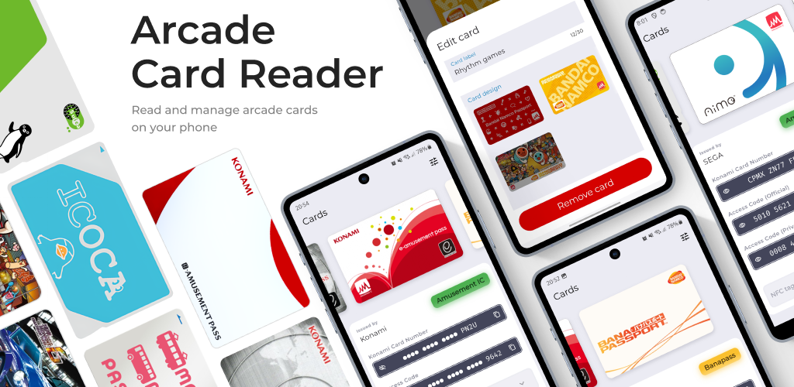

## Arcade Card Reader

Arcade Card Reader is an app for iPhone and Android that allows you to read the NFC data stored on various arcade cards.

    

### Supported cards include
- e-amusement passes (any type)
- FeliCa-based Travel IC cards such as PASMO, Suica, ICOCA, Octopus, etc.
- Official Amusement IC cards (Konami, Sega, Taito, Bandai Namco)
- Unofficial Amusement IC cards
- **Android only:** Banapassport
- **Android only:** Technika Platinum Crew cards

### Support

Bugs? Crashes? Questions? Suggestions? Feature requests? 

**[Contact us!](./contact.html)**

Copyright © 2025 Rem Tech AS. All rights reserved.
